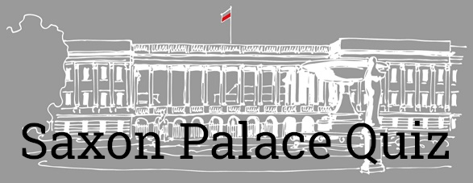
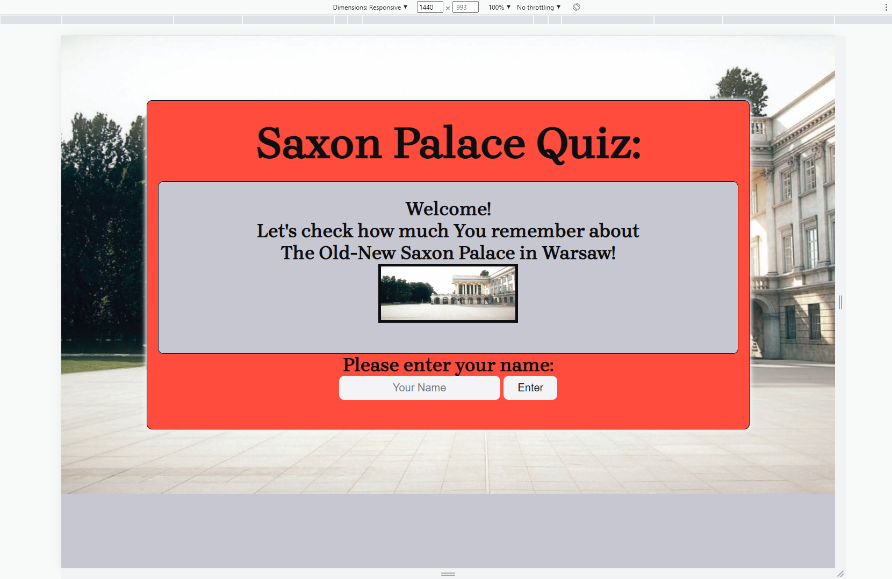
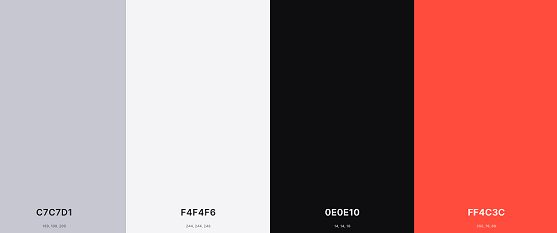

  

# Saxon-Palace-Quiz

## by DB

---

  

---

This is my Portfolio Project 2 (PP2) which is a part of the Code Institute’s Full Stack Software Development Diploma Course. This project demonstrates the skills and knowledge of the HTML, CSS, JavaScript, User Centric Frontend Development modules and Comparative Programming Languages modules which I have learned during the course.

#### [Click here to view the site.](https://dominikbbb.github.io/PP2-SP-Quiz/)
#### [Click here to view the repository.](https://github.com/DominikBBB/PP2-SP-Quiz)

---

# Table of Contents:

1. [Project Overview](#project-overview)
2. [User Experience(UX)](#user-experience-ux)
    1. [Target Audience](#target-audience)
    2. [User Stories](#user-stories)
    3. [Strategy](#strategy)
    4. [Scope](#scope)
    5. [Structure](#structure)
    6. [Skeleton](#skeleton)
        1. [Wireframes](#wireframes)
        2. [Mockups](#mockups)
    7. [Surface](#surface)
        1. [Colours](#colours)
        2. [Typography](#typography)
        3. [Images & Icons](#images-&-icons)
3. [Features](#features)
    1. [Existing Features](#existing-features)
    2. [Future Features](#future-features)
4. [Technologies](#technologies)
    1. [Languages](#languages)
    2. [Other Technologies](#other-technologies)
    3. [Resources](#Resources)
5. [Testing](#testing)
    1. [Tests](#tests)
        1. [HTML/CSS](#html-css)
        2. [JavaScript](#js)
        3. [Manual testing Browser testing](#manual-testing-browser-testing)
        4. [Performance Testing](#performance-testing)
        5. [Visual testing](#visual-testing)
        6. [Funcionality testing](#funcionality-testing)
        7. [Testing User Stories](#testing-user-stories)
    2. [Bugs and Fixes](#bugs-and-fixes)
6. [Deployment](#deployment)
7. [Credits](#credits)
8. [Acknowledgments](#acknowledgments)

---

# Project Overview:

The Saxon-Palace-Quiz is an online quiz for people who wants to test their knowledge about The Old-New Saxon Palace in Warsaw. Users will be invited to answer 10 questions based on the information provided on [The Old-New Saxon Palace](https://dominikbbb.github.io/PP1-Saxon-Palace/) website. They will be able to create their username. A score tracking system will calculate the final result.

This quiz web-app will target all people, both local residents and turists, who want to test their knowledge about past, present and future facts about The Old-New Saxon Palace.

[Back to Table Of Contents](#table-of-contents)

---

# User Experience UX:

## Target Audience:

- History enthusiasts,
- Local residents in Warsaw,
- Pupils, Student and Adults - People of all ages.

[Back to Table Of Contents](#table-of-contents)

## User Stories:

- As a user:

 1. I would like to be able to check my knowledge using an interesting online quiz-app,
 2. I would like to easily understand the quiz rules,
 3. I would like the application to be easy to navigate / single-use learning,
 4. I would like the site to be responsive on multiple different displays and devices,
 4. I would like to know my final score and check the correct answers,
 5. I would like to have a chance to retake the quiz to improve my results,
 6. I would like to track the quiz progress,
 7. I would like to find the link to the website where I can learn about Saxon Palace before I start the quiz.

- As a site creator:

 1. I want to make that the quiz-app and website are user friendly,
 2. I want to make sure that the quiz's rules are easily to understand,
 3. I want to ensure there are right enough information to prevent the user from becoming bored.
 

[Back to Table Of Contents](#table-of-contents)

## Strategy:

### Project Goals:

My goal in this project is to promote the Saxon Palace in Warsaw to the market to allow the users learn about history of the Palace and to raise the awareness of the purpose of the reconstruction.

### Business Goals:

1. Promote the Saxon Palace in Warsaw and its surroundings,
2. Allow the visitors of the quiz-app to check and improve their knowledge about the Saxon Palace,
3. Make easy to navigate web-app.

### Customer Goals:

1. Check and improve my knowledge about the Saxon Palace in Warsaw,
2. Easy to understand and navigate the quiz game,
3. Enjoying the time when playing the quiz.

[Back to Table Of Contents](#table-of-contents)

## Scope:

#### The scope of Saxon Palace Quiz page in its first release is defined by the following features:

- Fully responsive design quiz web-app,
- Interactive web-app which allows visitor to choose the player name,
- The number of single-choice questions which progress can be tracked,
- Correct and wrong answers tracking system,
- Final score,
- List of correct answers,
- Link to the source of information.

#### Features that are to be considered for future releases:

- Feedback and newsletter subscription form,
- Dark mode,
- Polish language version.

[Back to Table Of Contents](#table-of-contents)

## Structure:

This quiz-app is designed to be a one-page interactive website. The relevant sections of the quiz are shown or hidden, based on the user activity. The user clicks on the button in order to proceed through the quiz. To start the quiz, user need to enter their name which will be then populated on the welcome screen where the rules of the quiz are displayed. When the user is familiar with the rules, they can click the Start Button to start the quiz. Questions are presented one by one and the current question number is shown on the top of the page. To move to the next question, the current question must be answered. There are single-choice questions and the user will be informed immediately if he chose the correct or wrong answer. The summary of correctly answered questions is displayed on the last screen. Then the user has two choices; to take the quiz again by clicking on the Start Again button or to check correct answers by clicking the Check Answers Button. The user also can start the quiz again at any time by clicking the Restart Button. User can visit the Old-New Saxon Palace in Warsaw website before he starts the quiz by clicking the picture at the start page of the quiz. The link will open the Old-New Saxon Palace in Warsaw website in a new tab.

[Back to Table Of Contents](#table-of-contents)

## Skeleton:

### Wireframes:

 

[Back to Table Of Contents](#table-of-contents)

### Mockups:

[Back to Table Of Contents](#table-of-contents)

## Surface:

### Colours:

The colours that will be used throughout the site for its main styling are shown below, these colours have been picked to keep within the design brief of maintaining a simplified viewing pleasure.

The colours will be used in specific ways that complement one another:
- Lavender Grey (#C7C7D1) for backgroud,
- Cultured (#F4F4F6) for text,
- Rich Black Forga39 (#0E0E10) for text,
- Sunset Orange (#FF4C3C) for buttons,
which maintaining good contrast levels.

### Typography:

x
x
x

### Images & Icons:

x
x
x

[Back to Table Of Contents](#table-of-contents)

---

# Features:

## Existing Features:

x
x
x
x
x

## Future Features:

x
x
- Dark mode,
- Polish language version.

[Back to Table Of Contents](#table-of-contents)

---

# Technologies:

## Languages:

- [HTML5](https://en.wikipedia.org/wiki/HTML5),
- [CSS3](https://en.wikipedia.org/wiki/CSS).

## Other Technologies:

- [Gitpd & Git](https://gitpod.io/),
- [Visual Studio Code](https://code.visualstudio.com/),
- [GitHub](https://github.com/),
- [Bootstrap 5](https://getbootstrap.com/),
- [Chrome Developer Tools](https://developer.chrome.com/docs/devtools/),
- [Lighthouse](https://developers.google.com/web/tools/lighthouse),
- [W3school](https://www.w3schools.com/),
- [Color Palette Generator](https://coolors.co/),
- [Contrast Checker](https://webaim.org/resources/contrastchecker/),
- [Responsive Design](http://ami.responsivedesign.is/),
- [Google Fonts](https://fonts.google.com/),
- [Font Awesome](https://fontawesome.com/).

## Resources:

- [Code Institute Course Content](https://learn.codeinstitute.net/dashboard) - Main source of fundamental knowledge,
- [Code Institute SLACK Community] - Source of assistance,
- [Polish National Digital Archive](https://www.nac.gov.pl/) - Source of history information and images,
- [Palac Saski - Saski 2018](https://saski2018.pl/) - Source of history information and images,
- [Polish historical website](https://historia.org.pl) - Source of history information and images,
- [Virtual World Guide](https://navtur.pl/) - Source of history information and images,
- [Saski website](https://palacsaski.pl/) - Source of history information and images,
- [Polish National Radio Broadcaster](https://www.polskieradio.pl/) - Source of history information and images,
- [The official website of the President of the Republic of Poland](https://www.president.pl/) - Source of information,
- [Warsaw City News website](https://warszawa.naszemiasto.pl/) - Source of information,
- ["Independent" Project](https://niepodlegla.gov.pl/) - Source of history information and images,
- [Wikipedia](https://pl.wikipedia.org/) - Source of history information and images,
- [YouTube](https://www.youtube.com/) - Source of videos,
- [Grammarly](https://app.grammarly.com/) - help with grammar and typo check,
- [Google Maps](https://www.google.com/maps) - Source of the maps,
- [GitHub Community](https://github.com/) - Source of information, soluttions and suggestions,
- [Stack Overflow](https://stackoverflow.com/) - Source of knowledge,
- [MDN Web Docs](https://developer.mozilla.org/) - Source of knowledge.

  
[Back to Table Of Contents](#table-of-contents)

---

# Testing:

This project is a static website using HTML5, CSS3 and Bootstrap5 framework. The test is covering:

1. HTML/CSS validation,
2. Testing website responsiveness (Chrome, Edge, Firefox, Galaxy S10),
3. Website performance and best practise (Lighthouse Chrome Developer Tool),
4. Visual aspects of the website: fonts and colour contrast (Chrome Developer Tool),
5. Functionality - all links and buttons on each page working, contact form and layout,
6. User stories test.

## Tests:

### HTML CSS:

[HTML Validator](https://validator.w3.org/)

[Jigsaw CSS Validator](https://jigsaw.w3.org/css-validator/validator)

    

            
Valid CSS!

    

All tests completed and passed.

[Back to Table Of Contents](#table-of-contents)

### Manual testing Browser testing:

- [Chrome](TESTING-2.md)
- [Firefox](TESTING-2.md)
- [Edge](TESTING-2.md)
- [GalaxyS10](TESTING-2.md)

All tests completed and passed.

[Back to Table Of Contents](#table-of-contents)

### Performance Testing:

- [Chrome Dev Tools - Lighthouse](https://developers.google.com/web/tools/lighthouse/)

[Test results](TESTING-2.md)

All test completed and passed.

[Back to Table Of Contents](#table-of-contents)

### Visual testing:

Color contrast was tested using:

- [Chrome Developer Tools](https://developers.google.com/web/tools/chrome-devtools)
- [Contrast Checker](https://webaim.org/resources/contrastchecker/)

 All tests completed and passed.

[Back to Table Of Contents](#table-of-contents)

### Funcionality testing:

x
x
x
x
x
x
x
x
x

[Back to Table Of Contents](#table-of-contents)

### Testing User Stories:

#### First time user:

x
x
x
x
x

#### Returning User:

x
x
x
x
x

#### As a site creator:

x
x
x
x
x

All user expectations were fulfilled and tested to ensure user satisfaction.

[Back to Table Of Contents](#table-of-contents)

## Bugs and Fixes:

A few numbers of bugs showed up during the HTML and CSS validation process. They are all fixed and all pages passed validation process. Full list of bugs and validation results after they were fixed: [Bugs and Fixes](TESTING-1.md)

No more errors found.

[Back to Table Of Contents](#table-of-contents)

---

# Deployment:

## GitHub pages:

The steps to deploy via GitHub pages:

1. Log into Github account,
2. Navigate to the [Repository](https://github.com/DominikBBB/PP2-SP-Quiz),
3. Click the 'Settings' option at the top of the repository,
4. Click the 'Pages' option on the left-hand menu, located near the bottom,
5. Within the 'Source' tab Select the drop-down titled 'None',
6. Select the branch named 'main' (in some cases it can be named 'Master'),
7. Click 'Save',
8. You will be prompted with a URL to your deployed site,
9. Site deployed.

When the above steps have been completed, it can sometimes take a moment for the deployed URL to update. It is enough to refresh the page until the site is fully deployed.

## Forking The GitHub Repository:

To use this code and make changes without affecting the original code you can do what is called 'Forking the repository'. By forking this repository you are given a copy of the code at that moment in time that you can use freely. To fork this repository you need to follow the following few steps:

1. Log into your GitHub account,
2. Navigate to the [Repository](https://github.com/DominikBBB/PP2-SP-Quiz), you are willing to fork,
3. In the upper-right of the repository, click the 'Fork' button,
4. A copy of the Repository will now be available within your repositories.

You will now have a copy of the code available to clone and work on without affecting the original code.

## Cloning the Project:

To make a local clone of the project follow these steps:

1. Log into your GitHub account.
2. Navigate to the [Repository](https://github.com/DominikBBB/PP2-SP-Quiz),
3. In the upper section of the repository click the drop-down named 'Code',
4. Copy the SHH address,
5. Open GitBash,
6. Navigate to the correct directory,
7. Create a new directory named 'SP-Quiz',
8. CD into 'SP-Quiz',
9. Enter 'git clone SSH_ADDRESS',
10. GitBash will clone the repository into this directory,
11. enter 'code .'.

This will open VS CODE and allows you to enjoy coding.

  
[Back to Table Of Contents](#table-of-contents)

---

# Credits:

- [Code Institute Course Content](https://learn.codeinstitute.net/dashboard) - Lines of code from walkthrough projects,
- [Polish National Digital Archive](https://www.nac.gov.pl/) - content for historical information and images,
- [Palac Saski - Saski 2018](https://saski2018.pl/) - content for historical information and images,
- [Polish historical website](https://historia.org.pl) - content for historical information and images,
- [Virtual World Guide](https://navtur.pl/) - content for historical information and images,
- [Saski website](https://palacsaski.pl/) - content for historical information and images,
- [Polish National Radio Broadcaster](https://www.polskieradio.pl/) - content for historical information and images,
- [The official website of the President of the Republic of Poland](https://www.president.pl/) - content for information and images,
- [Warsaw City News website](https://warszawa.naszemiasto.pl/) - Source of information,
- ["Independent" Project](https://niepodlegla.gov.pl/) - content for historical information and images,
- [Wikipedia](https://pl.wikipedia.org/) - content for historical information and images,
- [YouTube](https://www.youtube.com/) - the video of the Saxon Palace reconstruction,
- [GitHub Community](https://github.com/) - suggestions for lines of code and descriptions in read.me,
- [Stack Overflow](https://stackoverflow.com/) - suggestions for lines of code,
- [Grepper Community](https://www.codegrepper.com/) - suggestions for lines of code,
- [Bootstrap 5](https://getbootstrap.com/) - suggestions for lines of code.

  
[Back to Table Of Contents](#table-of-contents)

---

# Acknowledgments:

I would like to thank:

- My mentor Chris Quinn for his helpful and valuable feedback and guidance and great support,
- Tutor support at Code Institute for their support,
- Slack #polish-community and #jan-2022-sb-5p groups for their suggestions and creative feedback,
- Friends and family for helping me with testing and mental support.

[Back to Table Of Contents](#table-of-contents)