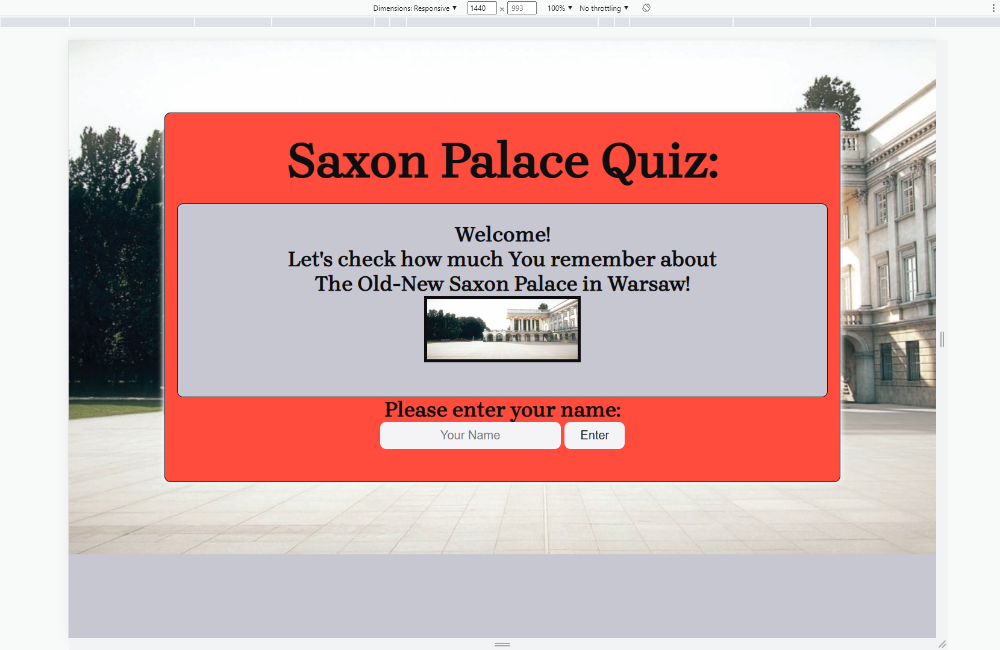
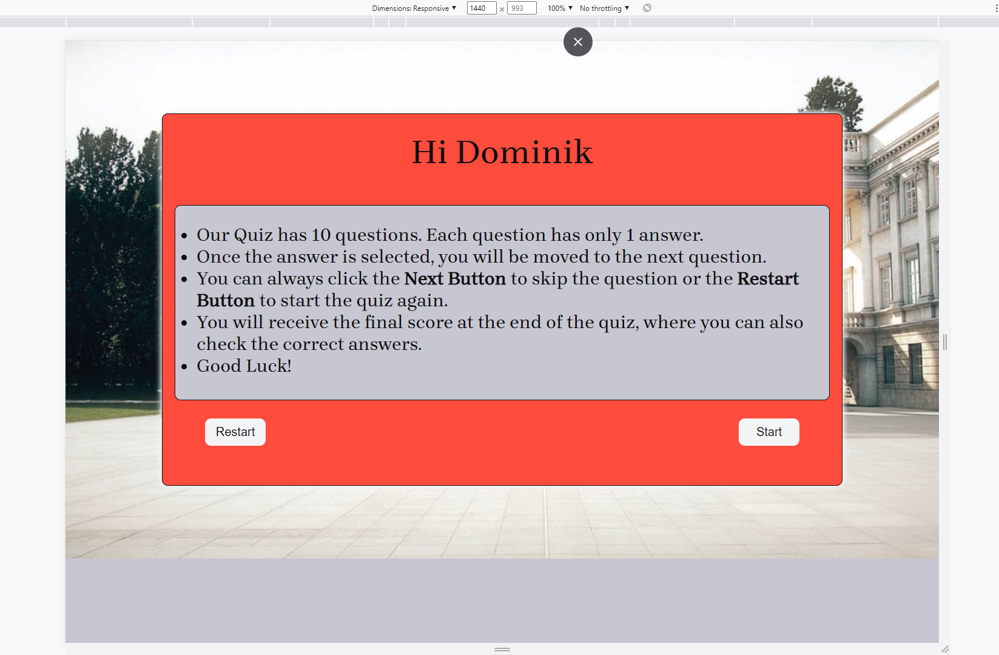
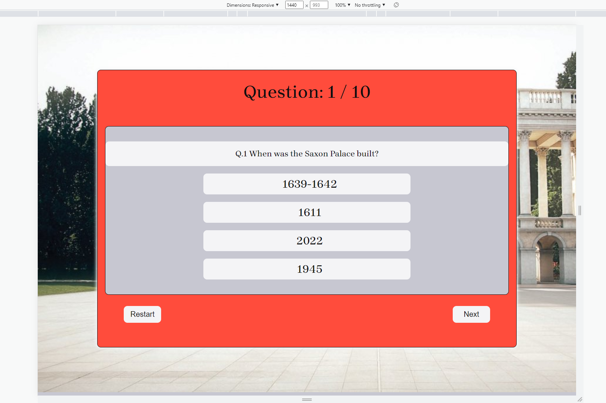
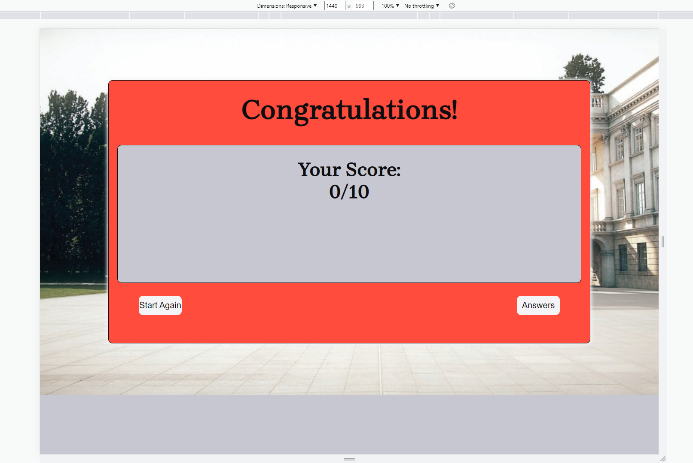
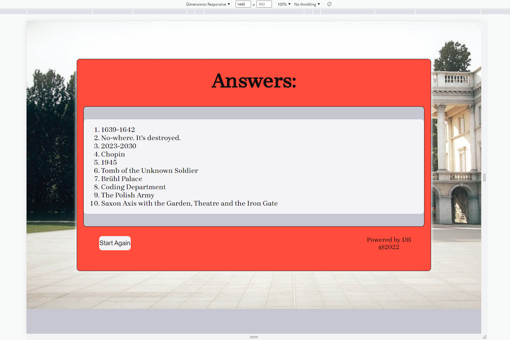

## Existing Features:
---
1. Welcome Page:

The welcome section is displayed on the screen informing the user about the quiz name. The user is asked to enter their name before the quiz can commence.
Once the player name is entered and Enter Button is clicked, the current section will no longer be visible.
The button (in each section of the quiz) is visually highlighted by the hover effect when the user hovers over it.

---

---
2. Rules Page:

To personalize the user experience, the section with quiz rules is displayed using the player name entered on the welcome screen.
The quiz rules are clearly explained to the user and are grouped as a list. Once the user is familiar with the quiz rules, they can start the quiz by clicking the Start Button. The current section will no longer be visible.

---

---
3. Quiz Page:

The quiz section screen is divided into three subsections. The top section is displaying the current question number. The middle section is displaying the current single-choice question with four possible answers. The bottom section is displaying the Next Button to skip the current question and Restart Button to start the quiz from the beginning. The quiz is navigated question by question. Each question must be answered to be scored and move to the next question. At the beginning of the quiz, all answers are deselected. To answer the question, the user must click on the chosen answer. The system will immediately inform the player if the answer is correct (green color) or wrong (red color) and move to next question. The current section will no longer be visible.

---

---
4. Results Page:

The quiz will end the 10 questions are answered. The summary of correctly answered questions will be displayed on the screen.
The user has two choices at this stage: To take the quiz again if they want to improve their score – the Start Again Button will start a new quiz, or check correct answers by clicking the Answers Button.

---

---
5. Answers Page:

This section will present the list of all correct answers. There is the Start Again Button to start the quiz again from the beginning.

---
